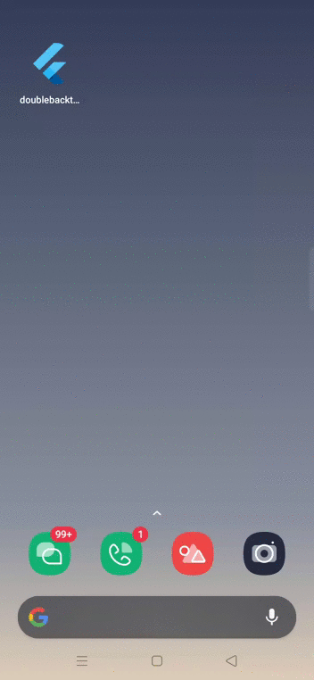
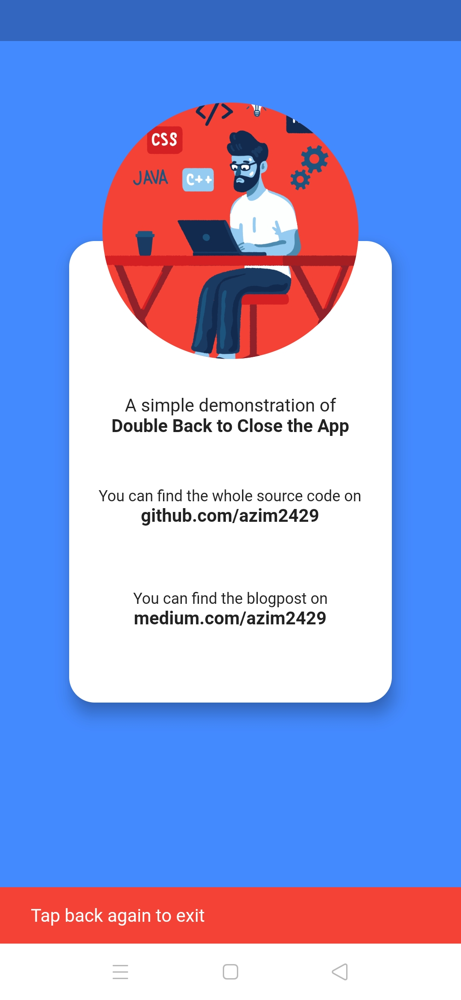

# Double Back to Close 🔙 
A Flutter app that allows users close the app by pressing the back button twice.
The app uses [double_back_to_close_app](https://pub.dev/packages/double_back_to_close_app) package.

## Demo

&nbsp;&nbsp;&nbsp;&nbsp;&nbsp;&nbsp;&nbsp;&nbsp;&nbsp;&nbsp;
